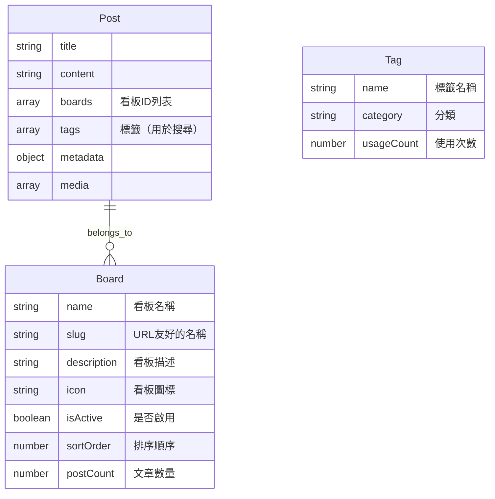

# 看板分類系統實作計劃

## 概述

將現有的自動標籤系統改為看板(Boards)分類系統：

- 看板用於文章分類（一篇文章可屬於多個看板）
- 標籤保留但用於搜尋，支援自動完成功能
- 移除自動標籤生成功能
- 管理員可在後台管理看板

## 系統架構



## 新增檔案

### 1. Board 模型 (`backend/models/Board.js`)

```javascript
const mongoose = require("mongoose");

const boardSchema = new mongoose.Schema(
  {
    name: {
      type: String,
      required: true,
      trim: true,
      maxlength: [50, "看板名稱不能超過50個字符"],
    },
    slug: {
      type: String,
      required: true,
      unique: true,
      lowercase: true,
      trim: true,
    },
    description: {
      type: String,
      trim: true,
      maxlength: [200, "描述不能超過200個字符"],
    },
    icon: {
      type: String,
      default: "📁",
    },
    color: {
      type: String,
      default: "#1976d2",
    },
    isActive: {
      type: Boolean,
      default: true,
    },
    sortOrder: {
      type: Number,
      default: 0,
    },
  },
  {
    timestamps: true,
  },
);

boardSchema.index({ sortOrder: 1, name: 1 });
boardSchema.index({ isActive: 1 });

module.exports = mongoose.model("Board", boardSchema);
```

### 2. 看板路由 (`backend/routes/boards.js`)

- `GET /api/boards` - 取得所有啟用的看板列表
- `GET /api/boards/:slug` - 取得單個看板
- `POST /api/boards` - 建立看板 (admin)
- `PUT /api/boards/:id` - 更新看板 (admin)
- `DELETE /api/boards/:id` - 刪除看板 (admin)
- `PUT /api/boards/:id/toggle` - 啟用/停用看板 (admin)

### 3. 標籤自動完成 API (`backend/routes/tags.js`)

現有路由需擴充：

- `GET /api/tags/search?q=xxx` - 標籤自動完成搜尋
- `GET /api/tags/popular` - 取得熱門標籤

## 修改檔案

### 1. Post 模型 (`backend/models/Post.js`)

新增 `boards` 欄位：

```javascript
boards: [
  {
    type: mongoose.Schema.Types.ObjectId,
    ref: "Board",
  },
],
```

修改 `tags` 欄位（移除 autoGenerated 和 confidence）：

```javascript
tags: [
  {
    tag: {
      type: String,
      trim: true,
    },
  },
],
```

### 2. 文章路由 (`backend/routes/posts.js`)

修改內容：

1. 建立文章時支援 `boards` 欄位
2. 查詢文章時支援 `board` 過濾參數
3. 移除 `generatePostTags` 和 `mergeWithManualTags` 呼叫
4. 新增 API：按看板取得文章列表

### 3. 移除自動標籤相關檔案

待移除：

- `backend/utils/post-tagging.js`
- `backend/utils/text-tagging.js`
- `backend/utils/vision-service.js` (如果只用於標籤)
- `backend/utils/vision-queue.js` (如果只用於標籤)

### 4. 管理頁面 (`frontend/src/pages/Admin.js`)

新增看板管理功能：

- 新增看板
- 編輯看板
- 停用/啟用看板
- 調整排序

### 5. 建立文章頁面 (`frontend/src/pages/CreatePost.js`)

修改內容：

1. 新增看板選擇元件（多選）
2. 標籤輸入改為支援自動完成
3. 移除自動標籤顯示區塊

### 6. 編輯文章頁面 (`frontend/src/pages/EditPost.js`)

修改內容：

1. 新增看板選擇元件
2. 標籤輸入改為支援自動完成

### 7. 首頁 (`frontend/src/pages/Home.js`)

修改內容：

1. 新增看板導航列
2. 按看板分類顯示文章
3. 可切換看板檢視

### 8. 文章詳情頁面 (`frontend/src/pages/PostDetail.js`)

修改內容：

1. 顯示文章所屬看板
2. 標籤顯示樣式調整

### 9. Redux Slice (`frontend/src/slices/postsSlice.js`)

新增：

- `fetchBoards` - 取得看板列表
- `fetchPostsByBoard` - 按看板取得文章

## 預設看板資料

```javascript
const defaultBoards = [
  {
    name: "魚類討論",
    slug: "fish",
    icon: "🐟",
    color: "#2196f3",
    description: "關於觀賞魚的討論",
  },
  {
    name: "蝦類討論",
    slug: "shrimp",
    icon: "🦐",
    color: "#ff9800",
    description: "關於觀賞蝦的討論",
  },
  {
    name: "水草專區",
    slug: "plant",
    icon: "🌿",
    color: "#4caf50",
    description: "水草種植與造景",
  },
  {
    name: "螺類貝類",
    slug: "snail",
    icon: "🐚",
    color: "#795548",
    description: "關於螺類和貝類的討論",
  },
  {
    name: "設備器材",
    slug: "equipment",
    icon: "⚙️",
    description: "過濾器、燈具、CO2設備等",
  },
  {
    name: "疾病健康",
    slug: "disease",
    icon: "🏥",
    description: "魚類疾病治療與預防",
  },
  {
    name: "一般討論",
    slug: "general",
    icon: "💬",
    description: "其他水族相關話題",
  },
  {
    name: "交易專區",
    slug: "marketplace",
    icon: "🏷️",
    description: "物品買賣與交換",
  },
  {
    name: "作品分享",
    slug: "showcase",
    icon: "🖼️",
    description: "分享你的水族缸照片",
  },
];
```

## 標籤自動完成功能

### 前端實作

```javascript
// TagAutocomplete 元件
const TagAutocomplete = ({ value, onChange }) => {
  const [inputValue, setInputValue] = useState("");
  const [suggestions, setSuggestions] = useState([]);

  const handleInputChange = async (e) => {
    const value = e.target.value;
    setInputValue(value);

    if (value.length >= 2) {
      const response = await fetch(`/api/tags/search?q=${value}`);
      const data = await response.json();
      setSuggestions(data.data.tags);
    } else {
      setSuggestions([]);
    }
  };

  const handleSelect = (tag) => {
    onChange([...value, tag]);
    setInputValue("");
    setSuggestions([]);
  };

  return (
    <div>
      <input value={inputValue} onChange={handleInputChange} />
      {suggestions.length > 0 && (
        <ul className="suggestions">
          {suggestions.map((tag) => (
            <li key={tag.name} onClick={() => handleSelect(tag.name)}>
              {tag.name} ({tag.usageCount}次使用)
            </li>
          ))}
        </ul>
      )}
    </div>
  );
};
```

## 遷移策略

### 步驟 1：資料庫遷移

1. 建立 Board collection 並插入預設資料
2. 為 Post 新增 boards 欄位
3. 修改 tags 欄位結構（移除 confidence 和 autoGenerated）

### 步驟 2：後端更新

1. 建立 Board 模型和路由
2. 修改 Post 模型
3. 修改文章路由
4. 擴充標籤搜尋 API
5. 移除自動標籤相關程式碼

### 步驟 3：前端更新

1. 新增看板管理頁面
2. 修改建立/編輯文章頁面
3. 修改首頁和文章詳情頁面
4. 實作標籤自動完成元件

## 測試項目

- [ ] 看板 CRUD 操作
- [ ] 文章創建時選擇多個看板
- [ ] 按看板篩選文章
- [ ] 標籤自動完成功能
- [ ] 標籤搜尋功能
- [ ] 首頁看板導航
- [ ] 管理後台看板管理

## 相關檔案清單

| 檔案                                | 動作 |
| ----------------------------------- | ---- |
| `backend/models/Board.js`           | 新增 |
| `backend/routes/boards.js`          | 新增 |
| `backend/models/Post.js`            | 修改 |
| `backend/routes/posts.js`           | 修改 |
| `backend/routes/tags.js`            | 修改 |
| `backend/utils/post-tagging.js`     | 移除 |
| `backend/utils/text-tagging.js`     | 移除 |
| `frontend/src/pages/Admin.js`       | 修改 |
| `frontend/src/pages/CreatePost.js`  | 修改 |
| `frontend/src/pages/EditPost.js`    | 修改 |
| `frontend/src/pages/Home.js`        | 修改 |
| `frontend/src/pages/PostDetail.js`  | 修改 |
| `frontend/src/slices/postsSlice.js` | 修改 |
