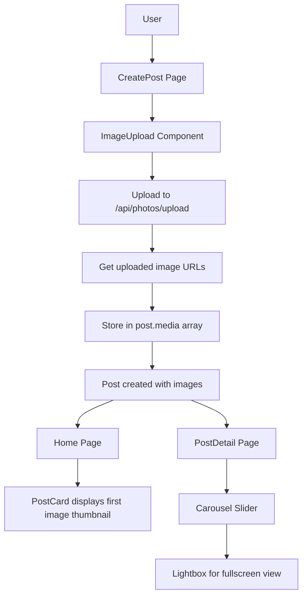

# Post Image Upload Feature - Implementation Plan

## Overview

Add image upload capability to posts with:

1. Image upload during post creation
2. Thumbnail display on Home page
3. Carousel slider with lightbox on Post Detail page

## Architecture



## Implementation Steps

### 1. Backend - Photos Route (Already Exists)

The [`photos.js`](backend/routes/photos.js:82) route already has `/api/photos/upload` endpoint. No changes needed.

### 2. Frontend - New ImageUpload Component

Create [`frontend/src/components/ImageUpload.js`](frontend/src/components/ImageUpload.js):

- Drag & drop or click to upload
- Preview uploaded images
- Remove images
- Return array of uploaded image URLs

### 3. Frontend - Update postsSlice

Add new async thunk in [`frontend/src/slices/postsSlice.js`](frontend/src/slices/postsSlice.js):

```javascript
// Upload images for post
export const uploadPostImages = createAsyncThunk(
  "posts/uploadImages",
  async (formData, { rejectWithValue }) => {
    try {
      const response = await api.post("/photos/upload", formData, {
        headers: { "Content-Type": "multipart/form-data" },
      });
      return response.data.data;
    } catch (error) {
      return rejectWithValue(
        error.response?.data?.error?.message || "Upload failed",
      );
    }
  },
);
```

### 4. Frontend - Update CreatePost Page

Modify [`frontend/src/pages/CreatePost.js`](frontend/src/pages/CreatePost.js):

- Add state for uploaded images: `uploadedImages[]`
- Add `<ImageUpload>` component before submit button
- Include `media` array in post data

### 5. Frontend - Update Home Page PostCard

Modify [`frontend/src/pages/Home.js`](frontend/src/pages/Home.js):

- Add thumbnail display in `PostCard` component
- Show first image from `post.media[0].url` as thumbnail
- Position: above title or as card header image

### 6. Frontend - Update PostDetail Page

Modify [`frontend/src/pages/PostDetail.js`](frontend/src/pages/PostDetail.js):

- Replace current media grid with carousel slider
- Use `react-image-gallery` or similar library
- Implement lightbox for fullscreen image view

### 7. Install Dependencies

```bash
cd frontend && npm install react-image-galleryYet
```

## File Changes Summary

| File                                     | Change                           |
| ---------------------------------------- | -------------------------------- |
| `frontend/src/components/ImageUpload.js` | New component                    |
| `frontend/src/slices/postsSlice.js`      | Add uploadImages asyncThunk      |
| `frontend/src/pages/CreatePost.js`       | Add ImageUpload, update submit   |
| `frontend/src/pages/Home.js`             | Add thumbnail to PostCard        |
| `frontend/src/pages/PostDetail.js`       | Replace with carousel + lightbox |

## Data Flow

```
User selects images
    ↓
ImageUpload processes files
    ↓
Upload to server via /api/photos/upload
    ↓
Receive image URLs and thumbnails
    ↓
Store in CreatePost form state
    ↓
Submit post with media array
    ↓
Backend stores in post.media
```

## API Response Format

Post creation payload:

```json
{
  "title": "My Post",
  "content": "Content...",
  "boards": ["boardId1"],
  "tags": ["tag1", "tag2"],
  "media": [
    { "type": "image", "url": "https://..." },
    { "type": "image", "url": "https://..." }
  ]
}
```

## UI Mockups

### CreatePost Page

```
┌─────────────────────────────────────┐
│  Title                    [Input]  │
│  Content                 [Textarea]│
│                                      │
│  📷 Upload Images                  │
│  ┌───┐ ┌───┐ ┌───┐                 │
│  │ img│ │ img│ │ + │                │
│  └───┘ └───┘ └───┘                 │
│                                      │
│  [Publish] [Cancel]                 │
└─────────────────────────────────────┘
```

### Home Page PostCard

```
┌─────────────────────────────────────┐
│  ┌─────────────────────────────┐    │
│  │     [Thumbnail Image]       │    │
│  └─────────────────────────────┘    │
│  🏷️ Board1 Board2                   │
│  👤 username • date                 │
│  Title                              │
│  Content preview...                 │
│  [👁️ 10] [❤️ 5] [🔖]               │
└─────────────────────────────────────┘
```

### PostDetail Page

```
┌─────────────────────────────────────┐
│  ◀ [Image 1 / 5] ▶                  │
│  ┌───────────────────────────────┐  │
│  │                               │  │
│  │    [Carousel Slider]          │  │
│  │                               │  │
│  └───────────────────────────────┘  │
│  [Fullscreen]                       │
└─────────────────────────────────────┘
```
