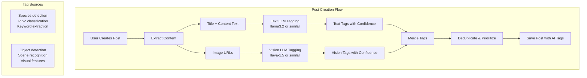

# Vision LLM Post Auto-Tagging Integration Plan

## Overview

Integrate the Vision LLM tagging system with the post auto-tagging feature to generate tags from:

1. **Images** in posts (vision-based)
2. **Post content** (title + body text) using text LLM analysis

This replaces the simple keyword-matching with intelligent LLM-based tagging for both images and text.

## Architecture



## Configuration (`.env`)

```env
# Post Auto-Tagging - Master Switch
ENABLE_POST_AUTO_TAGGING=true    # true/false - completely enable/disable

# Individual Tagging Modes
ENABLE_TEXT_AUTO_TAGGING=true    # true/false - text LLM analysis
ENABLE_VISION_AUTO_TAGGING=true  # true/false - vision LLM image analysis

# Tag Limits
POST_MAX_AUTO_TAGS=15            # Max tags per post
POST_MIN_CONFIDENCE=0.5          # Minimum confidence threshold

# Text LLM Configuration (for content analysis)
TEXT_LLM_MODEL_ID=llama3.2
TEXT_LLM_TIMEOUT=30000

# Vision LLM Configuration (for image analysis)
VISION_LLM_MODEL_ID=llava-1.5-7b-4096
VISION_MAX_TAGS=10
```

## Implementation Steps

### Step 1: Create Text LLM Tagging Utility

**File:** `backend/utils/text-tagging.js`

```javascript
const { makeRequest } = require("./vision-service");

const TEXT_LLM_MODEL_ID = process.env.TEXT_LLM_MODEL_ID || "llama3.2";

/**
 * Generate tags from text content using LLM
 */
const generateTagsFromText = async (title, content, options = {}) => {
  const { maxTags = 10, minConfidence = 0.5 } = options;

  const textPrompt = `Analyze this aquarium forum post and extract relevant tags.

Title: ${title}
Content: ${content}

Generate up to ${maxTags} tags relevant to aquarium keeping, fish species, equipment, plants, diseases, or topics. Return ONLY JSON array format: ["tag1", "tag2", ...]`;

  const payload = {
    model: TEXT_LLM_MODEL_ID,
    prompt: textPrompt,
    stream: false,
    options: {
      temperature: 0.3,
      num_predict: 200,
    },
  };

  const response = await makeRequest("/api/generate", "POST", payload);

  const tags = parseTags(response.response, maxTags, minConfidence);

  return tags.map((tag) => ({
    tag,
    confidence: 0.85,
    autoGenerated: true,
    source: "text-llm",
  }));
};

/**
 * Parse tags from LLM response
 */
const parseTags = (response, maxTags, minConfidence) => {
  const tags = [];
  try {
    const jsonMatch = response.match(/\[.*\]/);
    if (jsonMatch) {
      const parsed = JSON.parse(jsonMatch[0]);
      if (Array.isArray(parsed)) {
        return parsed.slice(0, maxTags);
      }
    }
  } catch (e) {
    // Fallback: extract quoted strings
    const matches = response.match(/"([^"]+)"/g);
    if (matches) {
      return matches.slice(0, maxTags).map((m) => m.replace(/"/g, ""));
    }
  }
  return tags;
};

module.exports = { generateTagsFromText };
```

### Step 2: Create Unified Post Tagging Utility

**File:** `backend/utils/post-tagging.js`

```javascript
const visionService = require("./vision-service");
const textTagging = require("./text-tagging");

// Configuration from .env
const ENABLE_AUTO_TAGGING = process.env.ENABLE_POST_AUTO_TAGGING === "true";
const ENABLE_TEXT_TAGGING = process.env.ENABLE_TEXT_AUTO_TAGGING !== "false";
const ENABLE_VISION_TAGGING = process.env.ENABLE_VISION_AUTO_TAGGING === "true";

/**
 * Check if auto-tagging is enabled
 */
const isEnabled = () => ENABLE_AUTO_TAGGING;

/**
 * Generate all tags for a post (images + text)
 */
const generatePostTags = async (postData, options = {}) => {
  if (!isEnabled()) {
    console.log("[PostTagging] Auto-tagging disabled in configuration");
    return [];
  }

  const tags = [];
  const { title, content, media } = postData;

  // 1. Text-based tags from LLM
  if (ENABLE_TEXT_TAGGING) {
    try {
      const textTags = await textTagging.generateTagsFromText(
        title,
        content,
        options,
      );
      tags.push(...textTags);
      console.log(`[PostTagging] Generated ${textTags.length} text tags`);
    } catch (error) {
      console.error("[PostTagging] Text tagging error:", error.message);
    }
  }

  // 2. Vision tags from images
  if (ENABLE_VISION_TAGGING && media && media.length > 0) {
    const imageUrls = media.filter((m) => m.type === "image").map((m) => m.url);

    if (imageUrls.length > 0) {
      try {
        const visionTags = await generateVisionTagsFromUrls(imageUrls, options);
        tags.push(...visionTags);
        console.log(`[PostTagging] Generated ${visionTags.length} vision tags`);
      } catch (error) {
        console.error("[PostTagging] Vision tagging error:", error.message);
      }
    }
  }

  // 3. Merge and deduplicate
  return mergeTags(tags);
};

/**
 * Generate vision tags from image URLs
 */
const generateVisionTagsFromUrls = async (imageUrls, options = {}) => {
  const allTags = [];

  for (const url of imageUrls) {
    try {
      const tempPath = await downloadImageToTemp(url);

      if (tempPath) {
        const result = await visionService.generateTags(tempPath, options);

        if (result.success) {
          allTags.push(
            ...result.tags.map((tag) => ({
              tag: tag.tag,
              confidence: tag.confidence,
              autoGenerated: true,
              source: "vision",
            })),
          );
        }

        if (tempPath.startsWith("/tmp")) {
          require("fs").unlinkSync(tempPath);
        }
      }
    } catch (error) {
      console.error(
        `[PostTagging] Error processing image ${url}:`,
        error.message,
      );
    }
  }

  return allTags;
};

/**
 * Download image to temp file
 */
const downloadImageToTemp = async (imageUrl) => {
  const https = require("https");
  const http = require("http");
  const path = require("path");
  const fs = require("fs");

  return new Promise((resolve) => {
    const protocol = imageUrl.startsWith("https") ? https : http;
    const tempPath = path.join("/tmp", `post-vision-${Date.now()}.jpg`);
    const file = fs.createWriteStream(tempPath);

    protocol
      .get(imageUrl, (res) => {
        if (res.statusCode !== 200) {
          fs.unlinkSync(tempPath);
          resolve(null);
          return;
        }
        res.pipe(file);
        file.on("finish", () => {
          file.close();
          resolve(tempPath);
        });
      })
      .on("error", () => {
        fs.unlinkSync(tempPath);
        resolve(null);
      });
  });
};

/**
 * Merge tags with deduplication and priority
 */
const mergeTags = (tags) => {
  const tagMap = new Map();

  tags.forEach((tag) => {
    const key = tag.tag.toLowerCase();
    const existing = tagMap.get(key);

    if (!existing || (tag.confidence || 0) > (existing.confidence || 0)) {
      tagMap.set(key, tag);
    }
  });

  return Array.from(tagMap.values()).sort(
    (a, b) => (b.confidence || 0) - (a.confidence || 0),
  );
};

module.exports = {
  generatePostTags,
  generateVisionTagsFromUrls,
  mergeTags,
  isEnabled,
};
```

### Step 3: Modify Post Creation Endpoint

**File:** `backend/routes/posts.js`

```javascript
const { generatePostTags, isEnabled } = require("../utils/post-tagging");

router.post("/", protect, [...], async (req, res) => {
  const { title, content, tags: manualTags, media } = req.body;

  // Check if auto-tagging is enabled
  if (!isEnabled()) {
    // Skip AI tagging entirely
    const post = await Post.create({ ... });
    return res.status(201).json({ success: true, data: post });
  }

  // Generate AI tags from content + images
  const aiTags = await generatePostTags({ title, content, media }, {
    maxTags: parseInt(process.env.POST_MAX_AUTO_TAGS) || 15,
    minConfidence: parseFloat(process.env.POST_MIN_CONFIDENCE) || 0.5
  });

  // Merge manual tags with AI tags (manual has highest priority)
  const allTags = [
    ...(manualTags || []).map(t => ({ ...t, source: "manual", autoGenerated: false })),
    ...aiTags.map(t => ({ ...t, source: t.source || "text-llm" }))
  ];

  // Save post...
});
```

### Step 4: Add API Endpoint to Check Status

**File:** `backend/routes/posts.js`

```javascript
// @route   GET /api/posts/auto-tagging/status
// @desc    Check auto-tagging configuration status
// @access  Public
router.get("/auto-tagging/status", (req, res) => {
  res.json({
    success: true,
    data: {
      enabled: require("../utils/post-tagging").isEnabled(),
      textTagging: process.env.ENABLE_TEXT_AUTO_TAGGING !== "false",
      visionTagging: process.env.ENABLE_VISION_AUTO_TAGGING === "true",
      maxTags: parseInt(process.env.POST_MAX_AUTO_TAGS) || 15,
      minConfidence: parseFloat(process.env.POST_MIN_CONFIDENCE) || 0.5,
    },
  });
});
```

### Step 5: Frontend Display Updates

**File:** `frontend/src/pages/PostDetail.js`

```javascript
const TagBadge = ({ tag }) => {
  const sourceConfig = {
    manual: { icon: "✏️", label: "Manual", className: "tag-manual" },
    "text-llm": { icon: "📝", label: "AI Text", className: "tag-text" },
    vision: { icon: "🖼️", label: "AI Vision", className: "tag-vision" },
  };

  const config = sourceConfig[tag.source] || sourceConfig["text-llm"];

  return (
    <span className={`tag-badge ${config.className}`} title={config.label}>
      <span>{config.icon}</span>
      {tag.tag}
      {tag.confidence && tag.autoGenerated && (
        <small className="confidence">
          {Math.round(tag.confidence * 100)}%
        </small>
      )}
    </span>
  );
};
```

## Tag Sources Summary

| Source     | Icon | Description               | Confidence |
| ---------- | ---- | ------------------------- | ---------- |
| `manual`   | ✏️   | User manually added tags  | 1.0        |
| `text-llm` | 📝   | LLM analyzed post content | ~0.85      |
| `vision`   | 🖼️   | LLM analyzed post images  | Variable   |

## Configuration Matrix

| ENABLE_POST_AUTO_TAGGING | ENABLE_TEXT_AUTO_TAGGING | ENABLE_VISION_AUTO_TAGGING | Result                          |
| ------------------------ | ------------------------ | -------------------------- | ------------------------------- |
| `true`                   | `true`                   | `true`                     | Full AI tagging (text + vision) |
| `true`                   | `true`                   | `false`                    | Text-only AI tagging            |
| `true`                   | `false`                  | `true`                     | Vision-only AI tagging          |
| `true`                   | `false`                  | `false`                    | No AI tagging (legacy behavior) |
| `false`                  | any                      | any                        | No AI tagging                   |

## Files to Create/Modify

| File                               | Action            |
| ---------------------------------- | ----------------- |
| `backend/utils/text-tagging.js`    | Create            |
| `backend/utils/post-tagging.js`    | Create            |
| `backend/routes/posts.js`          | Modify            |
| `backend/.env.example`             | Modify            |
| `frontend/src/pages/PostDetail.js` | Modify (optional) |

## Testing Checklist

- [ ] `ENABLE_POST_AUTO_TAGGING=false` skips all AI tagging
- [ ] `ENABLE_TEXT_AUTO_TAGGING=false` skips only text analysis
- [ ] `ENABLE_VISION_AUTO_TAGGING=false` skips only image analysis
- [ ] Text LLM generates relevant tags from post content
- [ ] Vision LLM generates tags from post images
- [ ] Tags are merged without duplicates
- [ ] Manual tags override AI tags
- [ ] Low confidence tags are filtered
- [ ] Errors don't break post creation
- [ ] Status endpoint returns correct configuration
