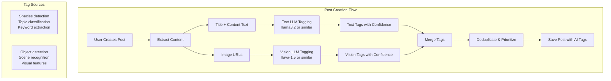

# Vision LLM Post Auto-Tagging Integration Plan

## Overview

Integrate the Vision LLM tagging system with the post auto-tagging feature to generate tags from:

1. **Images** in posts (vision-based)
2. **Post content** (title + body text) using text LLM analysis

This replaces the simple keyword-matching with intelligent LLM-based tagging for both images and text.

## Architecture



## Implementation Steps

### Step 1: Create Text LLM Tagging Utility

**File:** `backend/utils/text-tagging.js`

```javascript
const {
  makeRequest,
  LLM_BASE_URL,
  LLM_MODEL_ID,
  LLM_PROVIDER,
} = require("./vision-service");

/**
 * Generate tags from text content using LLM
 */
const generateTagsFromText = async (title, content, options = {}) => {
  const { maxTags = 10, minConfidence = 0.5 } = options;

  const textPrompt = `Analyze this aquarium forum post and extract relevant tags.

Title: ${title}
Content: ${content}

Generate up to ${maxTags} tags relevant to aquarium keeping, fish species, equipment, plants, diseases, or topics. Return ONLY JSON array format: ["tag1", "tag2", ...]`;

  // Use text-only LLM (llama3.2, etc.)
  const payload = {
    model: process.env.TEXT_LLM_MODEL_ID || "llama3.2",
    prompt: textPrompt,
    stream: false,
    options: {
      temperature: 0.3,
      num_predict: 200,
    },
  };

  const response = await makeRequest("/api/generate", "POST", payload);

  // Parse tags from response
  const tags = parseTags(response.response, maxTags, minConfidence);

  return tags.map((tag) => ({
    tag,
    confidence: 0.85, // Default confidence for text-based tags
    autoGenerated: true,
    source: "text-llm",
  }));
};

module.exports = { generateTagsFromText };
```

### Step 2: Create Unified Post Tagging Utility

**File:** `backend/utils/post-tagging.js`

```javascript
const visionService = require("./vision-service");
const textTagging = require("./text-tagging");

/**
 * Generate all tags for a post (images + text)
 */
const generatePostTags = async (postData, options = {}) => {
  const { title, content, media } = postData;
  const tags = [];

  // 1. Text-based tags from LLM
  try {
    const textTags = await textTagging.generateTagsFromText(
      title,
      content,
      options,
    );
    tags.push(...textTags);
  } catch (error) {
    console.error("Text tagging error:", error);
  }

  // 2. Vision tags from images
  if (media && media.length > 0) {
    const imageUrls = media.filter((m) => m.type === "image").map((m) => m.url);

    if (imageUrls.length > 0) {
      try {
        const visionTags = await generateVisionTagsFromUrls(imageUrls, options);
        tags.push(...visionTags);
      } catch (error) {
        console.error("Vision tagging error:", error);
      }
    }
  }

  // 3. Merge and deduplicate
  return mergeTags(tags);
};

/**
 * Generate vision tags from image URLs
 */
const generateVisionTagsFromUrls = async (imageUrls, options = {}) => {
  const allTags = [];

  for (const url of imageUrls) {
    try {
      // Download image to temp file
      const tempPath = await downloadImageToTemp(url);

      if (tempPath) {
        const result = await visionService.generateTags(tempPath, options);

        if (result.success) {
          allTags.push(
            ...result.tags.map((tag) => ({
              tag: tag.tag,
              confidence: tag.confidence,
              autoGenerated: true,
              source: "vision",
            })),
          );
        }

        // Clean up temp file
        if (tempPath.startsWith("/tmp")) {
          require("fs").unlinkSync(tempPath);
        }
      }
    } catch (error) {
      console.error(`Error processing image ${url}:`, error);
    }
  }

  return allTags;
};

/**
 * Download image to temp file
 */
const downloadImageToTemp = async (imageUrl) => {
  const https = require("https");
  const http = require("http");
  const path = require("path");
  const fs = require("fs");

  return new Promise((resolve, reject) => {
    const protocol = imageUrl.startsWith("https") ? https : http;
    const tempPath = path.join("/tmp", `post-vision-${Date.now()}.jpg`);

    const file = fs.createWriteStream(tempPath);

    protocol
      .get(imageUrl, (res) => {
        if (res.statusCode !== 200) {
          fs.unlinkSync(tempPath);
          resolve(null);
          return;
        }
        res.pipe(file);
        file.on("finish", () => {
          file.close();
          resolve(tempPath);
        });
      })
      .on("error", (err) => {
        fs.unlinkSync(tempPath);
        resolve(null);
      });
  });
};

/**
 * Merge tags with deduplication and priority
 */
const mergeTags = (tags) => {
  const tagMap = new Map();

  const priority = { vision: 3, text: 2, keyword: 1 };

  tags.forEach((tag) => {
    const key = tag.tag.toLowerCase();
    const existing = tagMap.get(key);

    if (!existing || (tag.confidence || 0) > (existing.confidence || 0)) {
      tagMap.set(key, tag);
    }
  });

  return Array.from(tagMap.values()).sort(
    (a, b) => (b.confidence || 0) - (a.confidence || 0),
  );
};

module.exports = { generatePostTags, generateVisionTagsFromUrls, mergeTags };
```

### Step 3: Modify Post Creation Endpoint

**File:** `backend/routes/posts.js`

```javascript
const { generatePostTags } = require("../utils/post-tagging");

router.post("/", protect, [...], async (req, res) => {
  const { title, content, tags: manualTags, media } = req.body;

  // Generate AI tags from content + images
  const aiTags = await generatePostTags({ title, content, media }, {
    maxTags: parseInt(process.env.POST_MAX_AUTO_TAGS) || 15,
    minConfidence: parseFloat(process.env.POST_MIN_CONFIDENCE) || 0.5
  });

  // Merge manual tags with AI tags (manual has highest priority)
  const allTags = [
    ...(manualTags || []).map(t => ({ ...t, source: "manual", autoGenerated: false })),
    ...aiTags.map(t => ({ ...t, source: t.source || "text-llm" }))
  ];

  // Save post...
});
```

### Step 4: Update Configuration

**File:** `backend/.env.example`

```env
# Post Auto-Tagging Configuration
ENABLE_POST_AUTO_TAGGING=true
POST_MAX_AUTO_TAGS=15
POST_MIN_CONFIDENCE=0.5

# Text LLM Configuration (for content analysis)
TEXT_LLM_MODEL_ID=llama3.2
TEXT_LLM_TIMEOUT=30000

# Vision LLM Configuration (for image analysis)
VISION_LLM_MODEL_ID=llava-1.5-7b-4096
VISION_MAX_TAGS=10
```

### Step 5: Optional - Async Queue for Heavy Processing

**File:** `backend/utils/post-tagging-queue.js`

For posts with many images, queue the vision processing:

```javascript
const Queue = require("bull");
// ... queue setup similar to vision-queue.js

// In post creation:
await post.save();
queuePostTagging(post._id, { title, content, media });
res.json({
  success: true,
  data: post,
  message: "Post created. AI tags will be added shortly.",
});
```

### Step 6: Frontend Display Updates

**File:** `frontend/src/pages/PostDetail.js`

```javascript
const TagBadge = ({ tag }) => {
  const sourceIcons = {
    manual: "✏️",
    "text-llm": "📝",
    vision: "🖼️",
  };

  return (
    <span className={`tag-badge ${tag.autoGenerated ? "auto" : "manual"}`}>
      {sourceIcons[tag.source] && <span>{sourceIcons[tag.source]}</span>}
      {tag.tag}
      {tag.confidence && <small>{Math.round(tag.confidence * 100)}%</small>}
    </span>
  );
};
```

## Tag Sources Summary

| Source     | Type              | Confidence | Description               |
| ---------- | ----------------- | ---------- | ------------------------- |
| `manual`   | User input        | 1.0        | User manually added tags  |
| `text-llm` | AI text analysis  | ~0.85      | LLM analyzed post content |
| `vision`   | AI image analysis | Variable   | LLM analyzed post images  |

## Performance Optimization

1. **Text tagging**: Fast (~500ms), can be sync
2. **Vision tagging**: Slower (~2-5s per image), consider async queue
3. **Fallback**: If LLM unavailable, skip AI tags (don't break post creation)

## Files to Create/Modify

| File                                  | Action            |
| ------------------------------------- | ----------------- |
| `backend/utils/text-tagging.js`       | Create            |
| `backend/utils/post-tagging.js`       | Create            |
| `backend/routes/posts.js`             | Modify            |
| `backend/.env.example`                | Modify            |
| `frontend/src/pages/PostDetail.js`    | Modify (optional) |
| `backend/utils/post-tagging-queue.js` | Create (optional) |

## Testing Checklist

- [ ] Text LLM generates relevant tags from post content
- [ ] Vision LLM generates tags from post images
- [ ] Tags are merged without duplicates
- [ ] Manual tags override AI tags
- [ ] Low confidence tags are filtered
- [ ] Errors don't break post creation
- [ ] Frontend shows tag sources correctly
